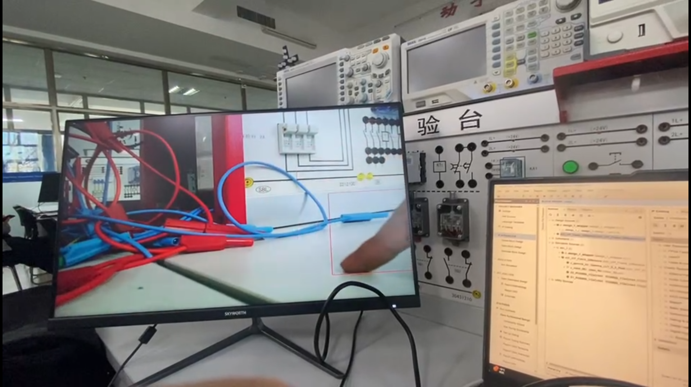
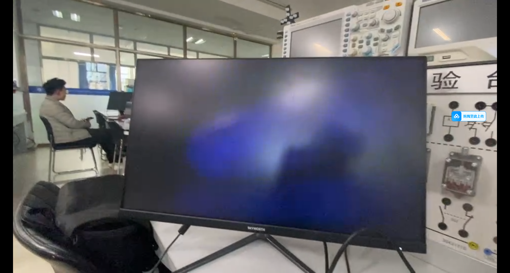
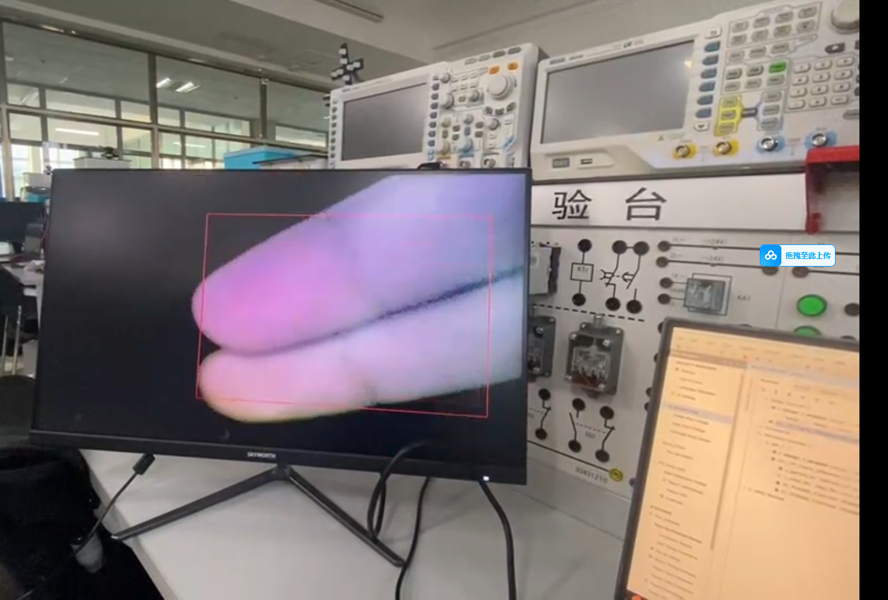

# Zynq7020 图像增强与目标检测系统

本项目是一个基于 `Zynq7020 + OV5640 + HDMI` 的实时图像处理系统，使用 Vivado 搭建硬件平台，使用 Vitis 编写上层控制程序，实现摄像头图像采集、HDMI 显示输出、图像增强以及基于帧差法的运动目标检测。

当前仓库已经整理为以主 Vivado 工程、主 Vitis 平台和主应用工程为核心的结构，便于后续复现、修改和继续开发。

## 项目简介

系统从 OV5640 摄像头采集图像，通过 FPGA/SoC 图像链路完成缓存、处理与输出，并最终在 HDMI 显示器上实时显示结果。

目前项目支持以下核心功能：

- OV5640 摄像头图像采集
- HDMI 实时显示输出
- 基于帧差法的运动目标检测
- 红色矩形框标注检测目标
- 基于 Gamma 0.5 的暗光图像增强
- 通过按键切换普通检测模式与增强辅助检测模式

## 工程结构说明

### 1. 主 Vivado 工程

主硬件工程位于：

- `V2_ov5640_hdmi/ov5640_hdmi.xpr`

这是当前项目真正的 Vivado 主工程，包含：

- `design_1_wrapper.xsa`：导出给 Vitis 使用的硬件平台文件
- `ov5640_hdmi.srcs/`：Block Design、约束文件、IP 和硬件源文件
- `ip_repo/`：项目自定义 IP

### 2. 主 Vitis 平台工程

主平台工程位于：

- `platform/`

这是当前 Vitis 应用工程依赖的平台工程。

### 3. 主 Vitis 应用工程

主软件工程位于：

- `ov5640_hdmi/`

其中真正的应用源码在：

- `ov5640_hdmi/src/`

主要包括：

- `main.c`：程序入口
- `display_ctrl_hdmi/`：HDMI 显示控制
- `dynclk/`：动态时钟相关代码
- `emio_sccb_cfg/`：SCCB/EMIO 配置
- `ov5640/`：OV5640 初始化代码
- `vdma_api/`：VDMA 控制代码

## 哪些目录不是主线工程

以下目录不是当前应重点维护的主工程：

- `ov5640_hdmi_system/`
  这是 Vitis 自动生成的 system project，主要用于打包、调试和启动，不是核心源码工程。

- `design_1_wrapper/`
  这是旧的或重复的 platform 工程副本，不是当前主应用依赖的平台。

- `V2_ov5640_hdmi/ov5640_hdmi.sdk/`
  这是旧版 SDK 工作区残留，不属于当前 Vitis 主流程。

## 功能说明

### 1. 普通检测模式

普通模式下，系统直接显示原始摄像头图像，并基于原始图像进行帧差检测。若检测到目标运动区域，则在输出图像上绘制红色矩形框。

### 2. 图像增强辅助检测模式

增强模式下，系统先对输入图像进行 Gamma 0.5 增强，再进行帧差检测。该模式主要用于低照度场景，可以提升暗部可见性，从而增强目标检测效果。

### 3. 模式切换逻辑

模式切换的核心逻辑在：

- `V2_ov5640_hdmi/ov5640_hdmi.srcs/sources_1/imports/project/AXI_VIP_Frame_Difference.v`

系统支持两种模式切换：

- 普通模式
- 图像增强辅助检测模式

该模块中：

- `touch_key` 用于切换模式
- `led` 用于指示当前模式状态

对应关系如下：

- `LED 灭`：普通模式
- `LED 亮`：增强辅助检测模式

### 4. 冷却机制

在模式切换后，系统会进入一个短暂的冷却阶段，暂时关闭目标框绘制。这样可以避免因背景缓存与当前图像亮度不一致而导致的全屏误检。冷却结束后，再恢复正常检测。

## 分辨率说明

当前软件默认配置为：

- 摄像头分辨率：`640 x 480`
- 显示模式：`VMODE_640x480`

相关配置位于：

- `ov5640_hdmi/src/main.c`

对应参数包括：

- `cmos_h_pixel = 640`
- `cmos_v_pixel = 480`
- `vd_mode = VMODE_640x480`

如果需要扩展到其他分辨率，可以继续修改 OV5640 初始化参数以及显示模式配置，并同步检查硬件设计链路是否匹配。

## 关键源码位置

### 摄像头初始化

- `ov5640_hdmi/src/ov5640/ov5640_init.c`

### HDMI 显示控制

- `ov5640_hdmi/src/display_ctrl_hdmi/`

### 动态时钟配置

- `ov5640_hdmi/src/dynclk/`

### VDMA 控制

- `ov5640_hdmi/src/vdma_api/`

### SCCB 配置

- `ov5640_hdmi/src/emio_sccb_cfg/`

### 图像增强与目标检测核心逻辑

- `V2_ov5640_hdmi/ov5640_hdmi.srcs/sources_1/imports/project/AXI_VIP_Frame_Difference.v`

### RGB 转 YCbCr 模块

- `V2_ov5640_hdmi/ov5640_hdmi.srcs/sources_1/imports/project/RGB888_YCbCr444.v`

## 效果展示

### 1. 正常光照下的目标检测效果

在正常光照环境中，系统可以稳定检测运动目标，并绘制红色目标框。

### 2. 黑夜/低照度环境下，未开启增强时的检测效果

在暗光场景下，原始模式下的图像亮度较低，目标检测效果不明显，容易出现无法稳定检测的问题。

### 3. 黑夜/低照度环境下，开启增强后的检测效果

开启图像增强后，图像暗部细节得到提升，目标更加清晰，系统可以重新检测并绘制目标框。

这组三图分别展示了正常检测、低照度下未增强无法稳定检测，以及开启图像增强后恢复目标检测的效果。

## 推荐使用流程

1. 使用 Vivado 打开主硬件工程：

   `V2_ov5640_hdmi/ov5640_hdmi.xpr`

2. 检查或重新生成硬件设计。

3. 确认硬件平台文件可用：

   `V2_ov5640_hdmi/design_1_wrapper.xsa`

4. 使用 Vitis 打开或导入：

   - `platform/`
   - `ov5640_hdmi/`

5. 编译应用程序并下载到开发板运行。

## 开发环境

推荐工具链：

- Xilinx Vivado 2020.2
- Xilinx Vitis 2020.2
- Zynq7020 开发板
- OV5640 摄像头模块
- HDMI 显示器

## 仓库说明

本仓库保留了项目的核心源文件和必要工程文件，同时通过 `.gitignore` 排除了以下内容：

- Vivado 生成缓存与运行结果
- Vitis 调试与构建输出
- 重复平台工程和 system 工程
- 旧版 SDK 工作区残留
- 日志、临时文件和 IDE 元数据

如果在其他机器上克隆本仓库，通常需要重新生成部分构建产物后再运行工程，但重建当前主线工程所需的核心文件均已保留。
